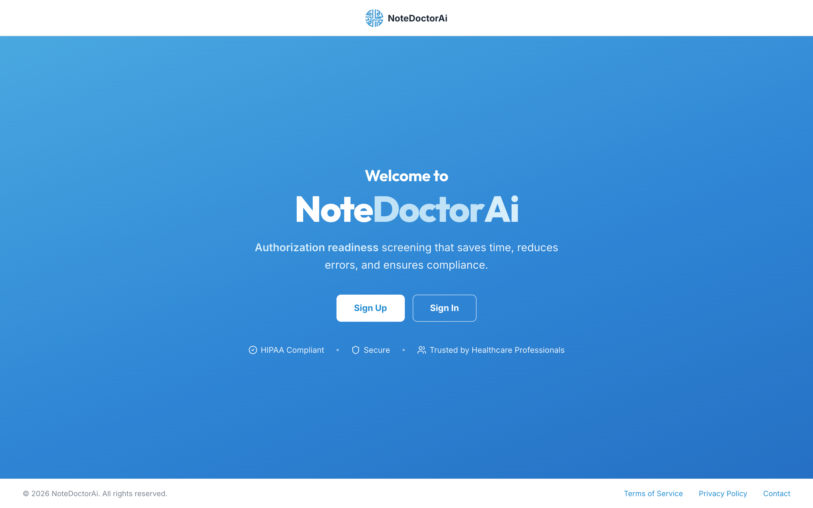
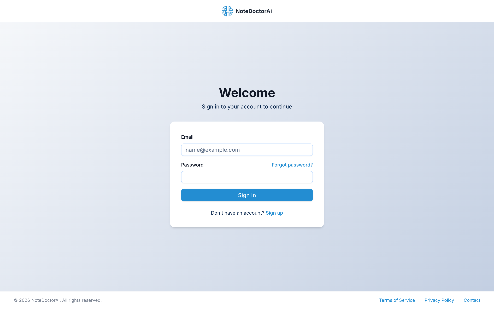
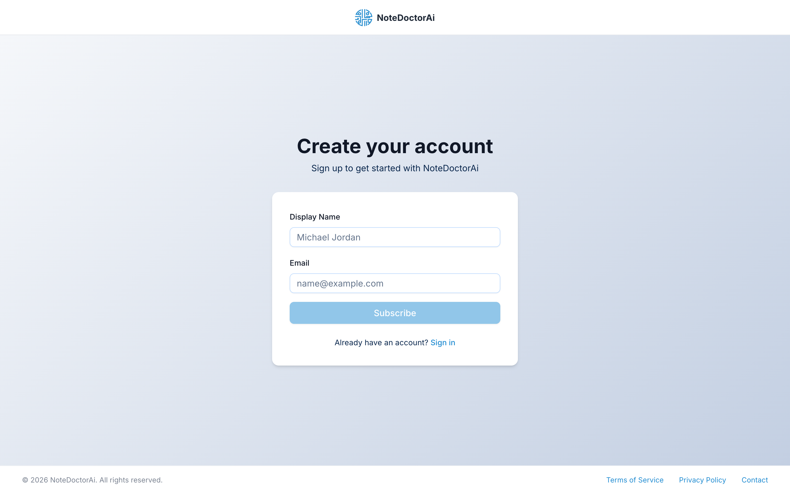
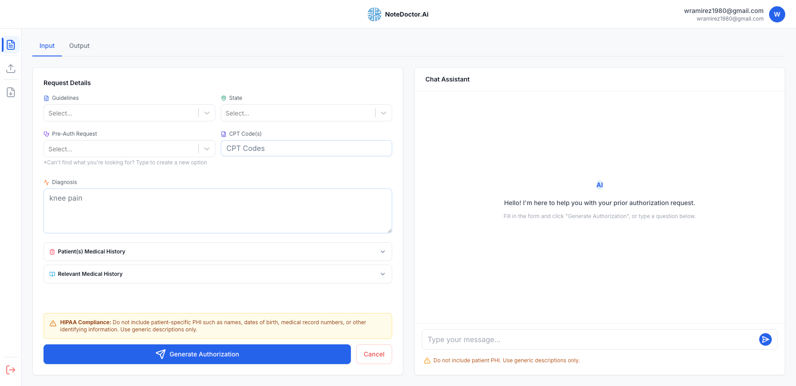

# NoteDoctorAi
## Authorization Readiness Screening for Healthcare Providers



NoteDoctorAi is a web application designed to streamline the prior authorization process for healthcare providers. Leveraging intelligent agent development with LangChain, it significantly reduces the administrative burden associated with obtaining necessary approvals from payers like Medicare and Cigna.

### Key Features:

* **Authorization Readiness Screening:** Instantly determine if a prior authorization (PA) is required for specific medical services, procedures, or medications.
* **Medicare NCD/LCD Insights:** Access and interpret National Coverage Determinations (NCDs) and Local Coverage Determinations (LCDs) from CMS, providing clear, evidence-based coverage criteria.
* **Commercial Payer Policy Analysis (e.g., Cigna):** Navigate the complexities of commercial insurance policies by analyzing published documents (like Cigna's Master Precertification Lists and EviCore guidelines) to infer PA requirements and criteria.
* **Documentation Review Checklist:** Receive a precise list of clinical documentation needed for a successful prior authorization submission, minimizing denials and delays.
* **Streamlined Workflow:** Designed to integrate seamlessly into a provider's existing workflow, offering quick lookups and actionable insights.
* **Reduced Administrative Burden:** Automate the time-consuming research phase of prior authorizations, allowing healthcare staff to focus on patient care.
* **HIPAA Compliant:** Built with healthcare compliance in mind, with clear warnings to avoid including patient-specific PHI.

### Technology Stack:

NoteDoctorAi is built with modern, scalable web technologies:

* **Next.js (App Router):** A powerful React framework for building fast, server-rendered, and highly scalable web applications.
* **LangChain / LangGraph:** Utilized for advanced **agent development** (`createReactAgent`), enabling the application to intelligently interact with various data sources (internal knowledge bases, external APIs, parsed documents) to reason and provide accurate authorization guidance.
* **Supabase:** Cookie-based SSR authentication and user management (Bearer token for mobile).
* **Stripe:** Subscription and metered billing.
* **TypeScript:** Ensures type safety and improves code quality and maintainability.
* **Tailwind CSS + shadcn/ui + Radix UI:** Component library and styling for a consistent, accessible interface.
* **Zod:** Used for robust schema validation of API inputs and outputs.
* **`pdf-parse` (via API Route):** A Node.js library employed in a dedicated Next.js API route to fetch and extract text content from PDF policy documents (e.g., Cigna's PDF guidelines).
* **CMS APIs:** Integration with official Medicare APIs for programmatic access to coverage data.
* **FHIR (Fast Healthcare Interoperability Resources):** Adherence to FHIR standards for potential future integrations with payer data (e.g., Cigna's Patient Access API for eligibility/benefits, Provider Directory).

### How it Works (High-Level):

The application functions by accepting details about a patient's service, diagnosis, and insurance payer. A LangChain-powered AI agent then orchestrates a series of actions:

1.  **Payer Identification:** Determines the relevant payer (e.g., Medicare, Cigna).
2.  **Policy Retrieval:**
    * For Medicare, it queries the CMS Coverage API for NCDs/LCDs.
    * For commercial payers like Cigna, it identifies and fetches relevant policy documents (e.g., PDFs from Cigna's portal) via a dedicated Next.js API route that uses `pdf-parse` for text extraction.
3.  **Analysis & Interpretation:** The extracted policy text is then analyzed by the LangChain agent's underlying Large Language Model (LLM) to infer specific prior authorization requirements, medical necessity criteria, and necessary documentation.
4.  **Structured Output:** The findings are presented to the user in a clear, structured format, providing actionable guidance.

### Application Preview:

**Landing Page**


The landing page provides a clean, professional interface with clear calls-to-action for healthcare providers to get started.

**Sign In**



**Sign Up**



Authentication is handled by Supabase, with a consistent, themed experience across the sign-in, sign-up, and password-reset flows.

**Main Application Interface**



The main interface features:
- **Request Details Form:** Input fields for guidelines, state, pre-auth request, CPT/HCPCS codes, diagnosis, and medical history
- **Chat Assistant:** Interactive chat interface for authorization analysis and guidance
- **HIPAA Compliance Warnings:** Prominent reminders to avoid including patient-specific PHI
- **Document Upload:** Support for uploading relevant medical history documents

### Setup and Installation:

To set up NoteDoctorAi locally, follow these steps:

1.  **Clone the Repository:**
    ```bash
    git clone https://github.com/wramirez09/langchain-agent.git
    cd langchain-agent
    ```
2.  **Install Dependencies:**
    ```bash
    yarn install
    # or
    npm install
    ```
3.  **Environment Variables:**
    Create a `.env.development.local` file in the root directory and add your keys:
    ```
    # OpenAI
    OPENAI_API_KEY=your_openai_api_key_here

    # Supabase
    NEXT_PUBLIC_SUPABASE_URL=your_supabase_url
    NEXT_PUBLIC_SUPABASE_ANON_KEY=your_supabase_anon_key
    SUPABASE_SERVICE_ROLE_KEY=your_supabase_service_role_key

    # Stripe
    STRIPE_SECRET_KEY=your_stripe_secret_key
    NEXT_PUBLIC_STRIPE_PUBLISHABLE_KEY=your_stripe_publishable_key
    STRIPE_WEBHOOK_SECRET=your_stripe_webhook_secret
    ```
4.  **Run the Application:**
    ```bash
    yarn dev
    # or
    npm run dev
    ```
    The application will be accessible at `http://localhost:3000`.

### Available Scripts:

```bash
yarn dev          # Start development server
yarn build        # Production build
yarn start        # Start production server
yarn lint         # Run ESLint
yarn format       # Prettier-format the app/ directory
yarn test         # Run the Jest test suite
```
